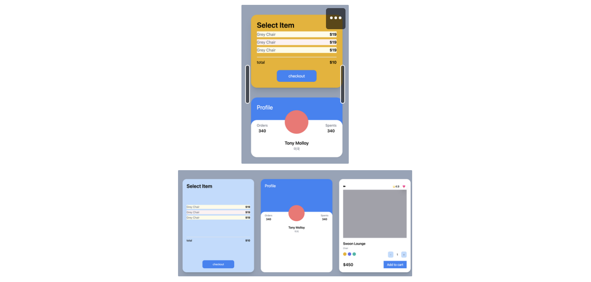

# TAILWIND

tailwind 사용을 하는 이유를 생각해보았는데 

사용해보면 해볼수록  css만으로 바로 처리 가능한 편리함이 있어서 아닐까 ?

단순히 색을 바꾸고 레이아웃을 바꾸는것은 css만으로 처리가 가능한데 

hover. active 할때 바로바로 처리할 수 있다는것이 내가 느끼기엔 매력적인것 같다. 

그리고 , form의 input들을 `peer-invalid` ,  `peer-valid` 에 따라서 보여지는 화면도 처리 할 수 있다는 점이 편리할 것 같다.

class명을 짓기위해 고민할 시간이 줄었다. 이로써 시간단축까지!!!


```jsx
호버
hover:text-black
클릭
active:bg-yellow-500
버튼 호버시 글자색 변경 
focus:bg-red-500

<div className="mt-5 bg-blue-500 text-white p-3 text-center rounded-xl w-2/4 mx-auto hover:bg-teal-500
          hover:text-black
          active:bg-yellow-500
          focus:bg-red-500">checkout</div>
```

ring


```jsx
focus:ring-2 ring-offset-2 ring-yellow-500 transition
<div className="space-x-2">
    <button className="w-5 h-5 rounded-full bg-yellow-500 focus:ring-2 ring-offset-2 ring-yellow-500 transition"></button>
    <button className="w-5 h-5 rounded-full bg-indigo-500 focus:ring-2 ring-offset-2 bg-indigo-500 transition"></button>
    <button className="w-5 h-5 rounded-full bg-teal-500 focus:ring-2 ring-offset-2 bg-teal-500 transition"></button>
</div>
```

odd: ,  even:, empty:


```jsx
odd:bg-yellow-50 
even:bg-red-50

[1,2,3,''] -> ''비어있는 값을 그릴때는 안보이도록 처리 하는 멋진 방법이 있음. empty:hidden!!!!!

<ul>
    {[1,2,3,''].map((i)=>(
      <div key={i} className="flex justify-between my-2 odd:bg-yellow-50 even:bg-red-50 empty:hidden">
          <span className="text-gray-500">Grey Chair</span>
          <span className="font-semibold">$19</span>
      </div>
    ))}
</ul>

```

카드자체를 마우스 오버 시 , 동그라미의 색상을 바꾸는 방법 group!!


```jsx
이벤트를 줄 영역을 감싸고있는 요소에 group 클래스를 부여한다. 
이벤트 타겟에 group-hover:bg-red-200 이런 식으로 스타일을 준다. 

<div className="bg-white overflow-hidden rounded-3xl shadow group">
    <div className="bg-blue-500 portrait:bg-indigo-600 p-6 pb-14 xl:pb-40">
        <span className="text-white text-2xl">Profile</span>
    </div>
    <div className="rounded-3xl p-6 bg-white relative -top-5">
        <div className="flex items-end relative -top-16 justify-between">
            <div className="flex flex-col items-center">
                <span className="text-sm text-gray-500">Orders</span>
                <span className="font-medium">340</span>
            </div>
            <div className="h-24 w-24 bg-red-400 rounded-full group-hover:bg-red-200 transition-colors"></div>
            <div className="flex flex-col items-center">
                <span className="text-sm text-gray-500">Spents</span>
                <span className="font-medium">340</span>
            </div>
        </div>
        <div className="relative mt-5 flex flex-col items-center -mt-10 -mb-5">
            <span className="text-lg font-medium">Tony Molloy</span>
            <span className="text-sm text-gray-500">미국</span>
        </div>
    </div>
</div>
```

input text 입력 창 , 입력 여부에 따른 각각 스타일 주기 

```jsx
입력창 스타일 
required:border-2 border-yellow-500

인풋창에 보여질 placeholder 스타일 주기 
placeholder-shown:bg-teal-500

입력 안되어있다면 
invalid:bg-red-500
되어있다면 
valid:bg-teal-500

<div className="bg-white p-6 rounded-3xl shadow">
    <form className="flex flex-col space-y-2 bg-blue-500 p-5 focus-within::bg-blue-100">
        <input type="text" required placeholder="Username" className="required:border-2 border-yellow-500 placeholder-shown:bg-teal-500 placeholder:text-red-500 valid:bg-teal-500"/>
        <input type="password" required placeholder="password" className="invalid:bg-red-500"/>
        <input type="submit" value="Login" disabled className="disabled:bg-red-200"/>
    </form>
</div>
```

입력 한경우  / 입력 안한 경우 - 하단 안내문구 스타일 변경


```jsx
<div className="bg-white p-6 rounded-3xl shadow">
  <form className="flex flex-col space-y-2">
      <input
          type="text"
          required
          placeholder="테스트중"
          className="border p-1 border-gray-400 rounded peer"
      />
      <span className="hidden peer-invalid:block peer-invalid: text-teal-500">This input is invalid</span>
      <span className="hidden peer-valid:block peer-invalid:text-red-500">Awesome username</span>
      <span className="hidden peer-valid:block peer-invalid:text-red-500 peer-hover:text-red-500">Hello</span>
      <input type="submit" value="Login" className=""/>
  </form>
</div>
```

리스트 펼치기 닫기


```jsx
리스트 1,2,3 혹은 점으로 표시 하는것 
list-decimal marker:text-teal-500

<div className="bg-white flex flex-col space-y-2 p-5">
    <details>
        <summary className="select-none cursor-pointer">what is my fav. food</summary>
				<span className="selection:text-purple-400">김치</span>
        <ul className="list-decimal marker:text-teal-500">
            <li>hi</li>
            <li>hi</li>
            <li>hi</li>
        </ul>
    </details>
</div>
```

file에 스타일 주기 file:


```jsx

file:cursor-wait
file:hover:text-purple-400
first-letter:

<div className="bg-white flex flex-col space-y-2 p-5">
    <input type="file" className="file:cursor-wait file:hover:text-purple-400 file:hover:border file:hover:bg-white file:transition-colors file:border-0 file:rounded-xl file:px-5 file:text-white file:bg-purple-400"/>
</div>
```

첫글자 강조하기 first-letter:


```jsx
<div className="bg-white flex flex-col space-y-2 p-5">
    <p className="first-letter:text-7xl first-letter:hover:text-purple-400">안녕하세요 저는 리액트를 배우고있어요.</p>
</div>
```

스크린 사이즈에 따른 각각의 카드의 사이즈와 스타일 ,카드의 배치를 다르게하는 방법 

lg: , md:, sm:


```jsx

lg:grid-cols-2 xl:grid-cols-3 min-h-screen
lg:col-span-2 xl:col-span-1
sm:bg-red-400 sm:hover:text-red-500 md:bg-yellow-500 lg:bg-indigo-400 xl:bg-blue-200 2xl:bg-amber-600"

<div className="bg-white p-6 rounded-3xl flex flex-col justify-between shadow-xl sm:bg-red-400 sm:hover:text-red-500 md:bg-yellow-500 lg:bg-indigo-400 xl:bg-blue-200 2xl:bg-amber-600">
	  <span className="font-semibold text-3xl">Select Item</span>
	  <ul>
	      {[1,2,3].map((i)=>(
	        <div key={i} className="flex justify-between my-2 odd:bg-yellow-50 even:bg-red-50">
	            <span className="text-gray-500">Grey Chair</span>
	            <span className="font-semibold">$19</span>
	        </div>
	      ))}
	  </ul>
	  <div className="mt-2 pt-2 border-t-2 flex justify-between">
	      <span>total</span>
	      <span className="font-semibold">$10</span>
	  </div>
	  <div className="mt-5 bg-blue-500 text-white p-3 text-center rounded-xl w-2/4 mx-auto hover:bg-teal-500
	  hover:text-black
	  active:bg-yellow-500
	  focus:bg-red-500">checkout</div>
	</div>
```

디바이스 가로 / 세로


`landscape:bg-teal-500`

`portrait:bg-indigo-600`

다크모드

```jsx
감싸고 있는 부모container에 dark를 주고 , 자식요소에 dark:bg-black 등 스타일을 준다. 
버튼을 클릭 시 , 부모container에 dark를 주어 다크모드를 구현 하면 좋을 듯 ! 
_app.tsx 파일에 dark를 줘서 완전한 다크모드 !

<div className="dark">
	<ul className="dark:text-white dark:bg-black">
	    {[1,2,3].map((i)=>(
	      <div key={i} className="flex justify-between my-2 odd:bg-yellow-50 even:bg-red-50 dark:text-white dark:odd:bg-black dark:even::bg-black ">
	          <span className="text-gray-500 dark:text-white dark:bg-black">Grey Chair</span>
	          <span className="font-semibold dark:text-white dark:bg-black">$19</span>
	      </div>
	    ))}
	</ul>
</div>
```

```jsx
테일윈드 콘피그파일에 darkMode:'class'를 넣어주면 위의 방법으로 동작 시킬 수 있다. 
예를들면 맥북 시스템 환경설정에서 다크모드 선택 시 바꿔주는 것을 원한다면 
darkMode:'media'를 적어주면 된다. 

/** @type {import('tailwindcss').Config} */
module.exports = {
  content: [
    "./pages/**/*.{js,jsx,ts,tsx}",
    "./components/**/*.{js,jsx,ts,tsx}",
  ],
  theme: {
    extend: {},
  },
  plugins: [],
  darkMode:'class'
}
```

많은 className들을 중첩해서 사용하면 , 조합의 수가 많아져서 css파일이 커진다. 

tailwind3.0 이전 버전에서는 중첩이 불가능했다. 지금은 tailwind3.0의 just-in-time 컴파일러로 인해 가능하게되었다.

이전엔 ,  배포하기 전에 파일 크기를 줄이기 위하여 파일을 스캔하여 사용하지않는 클래스명을 삭제하는 

purging프로세스가 필요했다. 그래서 중첩기능을 사용할 수 없었음 , 그러나 지금은 tailwind3.0의 just-in-time 컴파일러가 있어서  중첩이 가능해졌다. 

just-in-time 컴파일러는 , 내 코드를 실시간으로 확인해서 필요한 클래스를 생성한다 

```jsx
tailwind의 text 최대 사이즈는 text-9xl이다 . 
그러나 더 큰 혹은 내가 원하는 사이즈로 해야한다면 , 아래와 같이 사용가능하다. 

<div className="text-[12345px]"></div>
<div className="text-[#DCDCDD]"></div>
<div className="bg-[url('123.svg')]"></div>

```

tailwind css를 실무에서 많이 사용할까? 하는 궁금점이 생겨서 서치를 하다가 

잘 정리된 블로그를 첨부해둔다. 

[https://fe-developers.kakaoent.com/2022/220303-tailwind-tips/](https://fe-developers.kakaoent.com/2022/220303-tailwind-tips/)