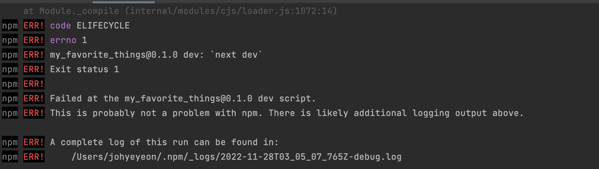
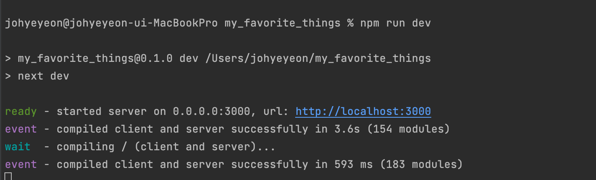

# npm ERR! code ELIFECYCLE 해결하기

npm 캐시와 node_modules, package-lock.json을 제거하고 npm 을 다시 install 해주면 된다.

```tsx
$ npm cache clean --force
$ rm -rf node_modules package-lock.json
$ npm install
```

쌓인 캐시를 지우고 : npm cache clean --force

`rm`  명령어는 디렉토리 삭제 명령어고,

`-rf` 옵션은 하위 디렉토리까지(r), 강제로(f) 삭제한다는 옵션이다.

오류


문제 해결




이렇게 해도 계속 오류가 나서 보니까 …

node의 버전문제일지도 모른다는 생각에 , 노드를 변경해주었더니 되었다.


파일을 만들어주고

```tsx
nvm install v[설치버전]
nvm use v[사용할 버전]
nvm ls 현재 설치된 노드 버전 리스트

node --v 노드 버전 확인

nvm --version nvm 버전 확인
```

이후 npm run dev 했더니 잘되었다.


