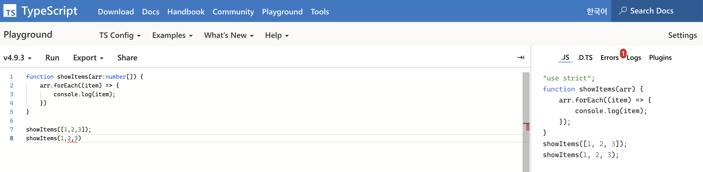
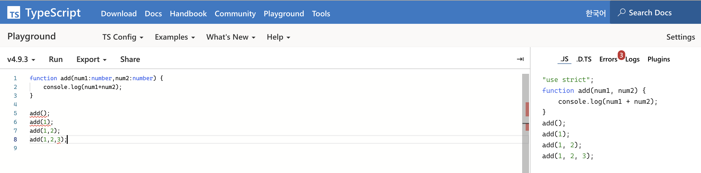

# 타입스크립트 정리

.ts 확장자

컴파일 단계에서 오류를 포착 할 수 있다!

데이터의 type도 알 수 있어서 코드의 가독성을 높이고 예측할수 있다.

자바스크립트에 의존적임 (자바스크립트로 컴파일된 후 실행)

복잡한 프로젝트에 적합하다.

javascript는 동적타입 언어라서 런타임시 type이 결정되지만 typescript는 정적타입이라 변수에 미리 타입을 선언후 컴파일시 타입을 체크해준다. 이러한 점에서 에러를 잡을 수 있고 다양한 브라우저에서 사용가능하도록 typescript로 작성하면 **javascript로 컴파일** 해주기 때문에 babel을 쓸 필요가 없다. 타입스크립트는 컴파일 과정에서 ES6+ 문법들을 ES5(또는 ES3)로 바꿔주기 때문에 Babel의 도움 없이 크로스브라우징 문제를 해결할 수 있다.

데이터구조를 **types와 interface**
를 사용하여 정의하면 처음부터 데이터구조에 대한 기존 보다 더 나은 설계를 만들 수 있다.



```tsx
function add(num1:number,num2:number) {
    console.log(num1+num2);
}

add(); // 오류
add(1); // 오류
add(1,2);
add(1,2,3); // 오류
```

```tsx
function add(num1, num2) {
    console.log(num1 + num2);
}
add();
add(1);
add(1, 2);
add(1, 2, 3);
```


```tsx
function showItems(arr:number[]) {
    arr.forEach((item) => {
        console.log(item);
    })
}

showItems([1,2,3]);
showItems(1,2,3) // 오류
```

```tsx
function showItems(arr) {
    arr.forEach((item) => {
        console.log(item);
    });
}
showItems([1, 2, 3]);
showItems(1, 2, 3);
```

```tsx
let age:number = 30;
let isAdult:boolean = true;
let a:number[] = [1,2,3];
let week:string[] = ['m','t','w'];
let a2:Array<number> = [1,2,3]
let a2:Array<string> = ['m','t','w'];

//튜플 (Tuple)
let b:[string,number];
b = ['z',1];
b[0].toLowerCase();
b[1].toLowerCase(); // 에러 

//void
function sayHello():void {
	console.log('hello')
}

//never
function showError():never {
	throw new Error();
}

function infLoop():never {
	while(true) {
		// do something ... 
	}
}

//enum : 특정 값만 입력할 수 있게 강제하고싶을 때, 그리고 그 값들이 공통점이 있을 때 enum을 사용하면된다.
// 인덱스는 0부터 시작 , 만약 window = 3 설정한다면 3,4,5
enum Os {
	window, 
	Ios,
	Android
}
// 숫자가 아닌 문자로도 설정 가능 
enum Os {
	window = 'win', 
	Ios = 'ios',
	Android = 'and'
}

let myOs : Os;
myOs = Os.window

// null , undefined
let a:null = null;
let b:undefined = undefined;

```

### interface

```tsx
let user:object;
user = {
	name : 'XX',
	age : 30
}

console.log(user.name) // 에러 
```

```tsx
type Score = 'A' | 'B' | 'c' | 'F' ;

inerface User {
	name : string;
	age : number;
	gender? : string;
	readonly birthYear : number;
	[key:number] : string;
	[key:number] : Score;
}

let user : user = {
	name : 'xx',
	age : 30,
	birthYear : 2000 // readonly를 붙이면 초기입력만 가능 ,
	1 : 'A',
	1: 'a' // 이건 오류가 발생한다. (	[key:number] : Score;) 

}

user.age = 10;
user.gender = 'male'; // 오류남.. 	gender? : string을 위에 입력 해줘야함 
uset.birthYear = 1990; // 오류남 , 읽기전용이기때문에 수정불가 
```

### interface 함수

```tsx
inerface Add {
	(num1:number, num2:number) : number;
}

conset add :  Add = function(x,y) {
	return x+y;
}

add(10,20);

interface IsAdult {
	(age:number):boolean;
}

const a:IsAdult = (age) => {
	return age > 19
}
```

참고한 강의:

[https://www.youtube.com/watch?v=OIMPLNICzoc&ab_channel=코딩앙마](https://www.youtube.com/watch?v=OIMPLNICzoc&ab_channel=%EC%BD%94%EB%94%A9%EC%95%99%EB%A7%88)